# Advanced LLM Agent Patterns for Ecosystem Integration

**Introduction:** In previous lessons, we covered fundamental patterns for using LLMs (like prompt design, structured outputs, basic retrieval augmentation, etc.). Now it’s time to explore more **advanced patterns** that enable complex agent behaviors and seamless integration into real-world ecosystems. These patterns build on earlier concepts but go further – orchestrating multiple agents, incorporating expert feedback (AI or human), managing long-term state, optimizing how we retrieve and cache knowledge, and indexing content with intelligent helpers. We focus on patterns **not fully covered before**, expanding our toolkit for production-grade LLM systems.

We'll dive into several advanced patterns, each with a **Problem** it addresses, a **Solution** approach, a **Mermaid diagram** to illustrate the flow, real **Use Cases**, and **Key Considerations** for implementation. These patterns draw on best practices observed by industry leaders like Anthropic and insights from recent research and community projects.

By the end, you should have a clear mental model of how to combine LLMs, tools, and humans into robust workflows. Remember Anthropic’s advice: start simple, then add complexity only when it demonstrably improves outcomes. The patterns below are modular pieces you can mix and match to build the *right* system for your needs. Let’s jump in! 🚀

---

## 1. Orchestrator-Worker Agents (Dynamic Task Delegation)

**Problem:** Some tasks are too complex for a single prompt or agent call – they involve multiple steps or distinct skills that an LLM must handle. In a fixed chain, we might not know ahead of time how many steps are needed or what they are. How can we *dynamically break down* a complex goal into subtasks and solve each with the appropriate expertise?

**Solution:** Use an **Orchestrator-Worker** pattern (also known as a **planning pattern**). Here one agent takes the role of a **Planner/Orchestrator**, which interprets the user request and decides on a plan of action. The orchestrator **decomposes** the task into smaller subtasks and delegates each subtask to specialized **Worker** agents (which could be other prompts/LLMs or tools suited for that subtask). It then gathers the results from the workers, checks if the overall goal is met, and synthesizes a final answer. If something is missing, the orchestrator can even re-plan or assign new subtasks on the fly. This pattern leverages the LLM’s ability to do high-level reasoning and coordination, while offloading detailed work to dedicated experts.

**Use Cases:**

* **Multi-step Coding Assistant:** A user requests a complex code change. The Orchestrator agent breaks it into steps (update function A, modify config B, write tests) and assigns each to a Coding agent. Results (code diffs, test outcomes) are gathered and assembled into a complete patch.
* **Research Report Generator:** Given a broad question, an Orchestrator plans sections (literature review, data analysis, conclusions) and dispatches worker calls for each. It then combines their outputs into a structured report.
* **Travel Planner:** The user asks for a 3-day trip itinerary. The planner agent creates sub-tasks: find flights, hotels, activities each day, etc., assigns these to specialized agents (Flight Booker, Hotel Finder, Activity Recommender), then compiles the final itinerary for the user.

**Key Considerations:**

* **Orchestration Overhead:** This pattern introduces complexity and multiple LLM calls. Ensure the improved quality outweighs the extra latency and cost. Use only when a task truly requires dynamic planning (if the steps are known and fixed, a simple chain might suffice).
* **Agent Interfaces:** Clearly define what each worker agent expects as input and produces as output (e.g. using structured formats). The orchestrator should adhere to these interfaces when delegating tasks. Miscommunication between agents can cause failures.
* **Error Handling:** The orchestrator should handle cases where a worker’s output is empty or low-confidence. It might retry subtasks, use a different approach, or ultimately return a partial answer with an apology. Robust error checking and maybe a timeout for each worker are important in production.
* **Avoiding Infinite Loops:** There’s a risk the orchestrator keeps adding subtasks or re-planning endlessly. Set safeguards like a maximum number of iterations or a sanity check to stop if progress stalls.
* **Debugging Complexity:** With many moving parts, traceability is crucial. Log each subtask prompt and result for debugging. Use unique IDs for tasks and maybe visualize the plan execution (this is where tools like a dashboard or tracing library help).

## 2. Multi-Agent Collaboration (Specialists & Swarms)

**Problem:** No single agent (or prompt) has to do everything. Often, we want multiple **specialist agents** working together, either in a coordinated fashion or as independent experts tackling a problem from different angles. How do we design a system where several LLM agents each contribute their unique expertise to achieve a complex goal?

**Solution:** Use a **Multi-Agent Pattern**, involving multiple LLM agents with distinct roles or perspectives collaborating on the task. There are a couple of common structures for multi-agent collaboration:

* **Coordinator & Specialists:** One agent acts as a **manager or router**, delegating subtasks to other specialist agents and integrating their responses (this is essentially the Orchestrator-Worker approach described above, which can be seen as a specific multi-agent architecture). For example, a “Project Manager” agent coordinates a “Coder” agent, a “Tester” agent, etc..
* **Swarm or Peer Collaboration:** Multiple agents operate more as peers, each analyzing the input or partial solutions concurrently (possibly with different skillsets or viewpoints), and then their outputs are merged or voted on for the final answer. This could be done by a simple majority vote, a confidence-weighted vote, or via an aggregator agent that considers each opinion.

*Example above: a coordinator mediating two expert agents.*

**Use Cases:**

* **AI Brainstorming Team:** Simulate a brainstorm by spawning multiple agents, each with a persona (e.g. “Optimist”, “Critic”, “SubjectMatterExpert”). They each generate ideas or arguments. A moderator agent (or simple script) aggregates the ideas and presents the best ones to the user. This resembles a **swarm of experts** approach where diverse viewpoints are generated in parallel.
* **Customer Support Triage:** An incoming support query goes to a Router agent that first classifies the issue (billing vs technical vs general). It then hands off to the appropriate specialist agent: e.g., a Tech Support agent vs. a Refund Policy agent, which provide the answer. (This is a multi-agent extension of a **routing pattern** – see earlier lessons – enabling specialized modules for each category.)
* **Debate or Verification Agents:** One agent generates an answer, another agent (or several) acts as a devil’s advocate or fact-checker. For instance, Agent A proposes a solution, Agent B attempts to find flaws or counterarguments. The system then reconciles them (either by letting them discuss or by using a third agent as a judge) to produce a refined, agreed result. This pattern is inspired by debate and can improve factual accuracy.

**Key Considerations:**

* **Coordination Overhead:** Introducing multiple agents means more prompts and more complexity in managing their interaction. Decide whether a **central coordinator** is needed or if a simple scheme (like parallel prompts with a fixed merging procedure) suffices. Coordinated agents can handle more complex interactions, but peer-based swarms are easier to implement.
* **Consistency and Context Sharing:** Multi-agent setups require careful handling of shared context. Will each agent get the entire user query or different parts? If they need to be aware of each other’s outputs (e.g., in a debate), you must pass messages between them or use a shared memory. Ensure one agent’s output is correctly incorporated into the next agent’s input when using handoff logic.
* **Conflict Resolution:** What if agents disagree or give conflicting results? You need a strategy: majority vote, a priority order (e.g., if the “Safety” agent says the content is disallowed, that verdict wins), or an arbitration agent that evaluates each answer. Define this logic clearly to avoid confusing final outputs.
* **Scalability:** The number of agents should be kept as low as needed – each additional agent adds cost and latency. However, you might parallelize their execution to save time (if using separate API calls). Also, consider an upper bound on how many agents you spin up, especially in a swarm approach, to avoid runaway resource use.
* **Observability:** Like with orchestrator patterns, logging each agent’s actions is vital. In complex multi-agent systems, a trace of the conversation between agents (or their independent outputs) can help debug why the final answer was chosen. Some open-source frameworks (e.g. LangGraph’s multi-agent swarm, or CrewAI) provide structured ways to define and monitor these interactions. If rolling your own, build in verbose debug modes.
* **When to use:** Multi-agent systems shine for **complex or ambiguous tasks** where different expertise or viewpoints reduce error. But if a single-agent or simple chain can do the job, using many agents could complicate things unnecessarily. Always balance the complexity vs. benefit.

## 3. Evaluator-Optimizer Loop (Self-Reflection Pattern)

**Problem:** LLMs sometimes produce suboptimal answers on the first try – maybe there’s a minor error, a missed requirement, or just a possibility to improve the clarity. How can we make an agent *iteratively refine* its output, catching mistakes or improving quality without human intervention?

**Solution:** Implement a **Reflection** or **Evaluator-Optimizer Loop**. In this pattern, one LLM generates an initial answer (the “optimizer” role) and then **another LLM (or the same one prompted differently) critiques** that answer (the “evaluator” role). The critique could include detecting errors, evaluating against a checklist of requirements, or suggesting improvements. The feedback is then fed into the original LLM (or a new invocation of it) to produce a revised answer. This cycle can repeat multiple times until the evaluator is satisfied or a max number of iterations is reached. Essentially, the AI is providing expert feedback to itself and learning from it on the fly, analogous to a writer proofreading and revising a draft.

**Use Cases:**

* **Code Generation with Auto-Fix:** The first LLM writes code given a spec. A second LLM then analyzes that code for bugs or mistakes (or even runs tests or a compiler via tools) and provides an error report. The first LLM (or a new call of it) uses that feedback to correct the code. This loop continues until the code passes all tests.
* **Document Draft Improvement:** An LLM writes a draft of a policy or an email. A second instance (with a prompt like “Review the above and point out any issues with tone, clarity, or completeness”) produces a critique. The original then revises the draft accordingly. After a couple of iterations, the final document is much more polished than the initial attempt.
* **Answer Completeness Check:** For complex Q\&A, you can have the LLM produce an answer, then have an evaluator agent verify if the answer addresses *all parts* of the question and is factually correct. If the evaluator finds gaps (“It didn’t mention X, which was asked”), that feedback is used to prompt the answerer to try again, this time including the missing info.

**Key Considerations:**

* **Clear Evaluation Criteria:** The quality of this loop depends on how well the evaluator can judge the output. Provide the evaluator with explicit instructions or criteria. For instance, give it a checklist: correctness, completeness, style guidelines. If the evaluator’s feedback is too vague (“this could be better”), the generator might not know how to act on it. Structured feedback (like a JSON with fields “evaluation: Pass/Fail” and “feedback: ...”) can help keep the loop focused.
* **Loop Termination:** Decide when to stop iterating. Options: a fixed number of iterations (say 2 or 3); stop early if the evaluator signals a PASS or “looks good now”; or if improvements become minimal. Always have a safety cutoff to avoid infinite loops if the evaluator keeps finding new nits to pick.
* **Cost vs. Gain:** Each iteration is additional compute and latency. In practice, 1-2 rounds of self-refinement often catch the big issues. Diminishing returns kick in quickly – you won’t usually need 10 cycles of self-critique. Monitor whether the improvements from the loop justify the cost. If not, simplify (maybe just one extra check step).
* **Single vs. Dual Model:** This pattern can be implemented with the same model playing both roles (just via prompt instructions) or two different models. Using the same model twice is simpler, but using a smaller/faster model as the evaluator could cut cost – **however** ensure the smaller model is actually capable of judging the bigger model’s output effectively. Sometimes a strong model is needed to properly critique a complex answer.
* **Error Amplification:** Beware of cases where the evaluator might be *wrong*. An LLM could incorrectly judge a correct answer as flawed (false negative) or vice versa. This might send the generator off track, actually making the answer worse. Mitigate by constraining the evaluator to objective criteria when possible, or by doing a final sanity check (maybe by a human or a final independent LLM call) on the final answer.
* **Relation to Evals:** This pattern is like an automated eval integrated into the agent. It’s essentially an **LLM feedback loop** built into your product. It complements offline evaluations (as discussed in earlier lessons) by catching issues on the fly in each interaction. In fact, some of your eval checklists can be directly repurposed as prompts for the evaluator agent.

## 4. Human-in-the-Loop Oversight

**Problem:** Even with reflection loops, LLM agents will sometimes fail or produce outputs that need a human’s judgement – especially in high-stakes domains (legal, medical) or open-ended creative tasks. We want to leverage AI speed while **keeping a human expert in the loop** for quality control or final approval. How can we design workflows where humans and LLMs collaborate effectively?

**Solution:** Introduce explicit **Human-in-the-Loop** steps in the agent’s workflow. Rather than full autonomy, the agent operates in a **semi-autonomous** mode: it pauses at certain checkpoints to get human review/feedback before proceeding or finalizing. This could be after generating a draft answer (human reviews and edits it), or after each subtask in a chain (human verifies before allowing it to continue), or simply as an approval gate at the end. The pattern ensures **meaningful human oversight** is integrated, as Anthropic suggests for tasks that enable feedback loops and oversight. The LLM essentially works as an assistant that knows when to defer to a person for confirmation.

**Use Cases:**

* **Content Moderation & Approval:** An AI system drafts responses to customer inquiries or generates marketing copy. Rather than auto-sending, it routes the draft to a human moderator or manager. The human quickly reviews for tone, accuracy, or policy compliance, makes edits if needed, then approves it to be sent out. This catches any potentially harmful or off-brand content the AI might have produced.
* **Medical or Legal Assistant:** An AI agent analyzes a case and suggests a diagnosis or legal argument. Instead of presenting directly to the end-user or court, a doctor or attorney in the loop reviews the suggestion. They can correct any errors or add human perspective. The final output is then given to the patient or used in a brief, with human sign-off. This pattern is crucial in regulated fields where AI cannot be fully trusted alone.
* **Agent Checkpoints in Workflow:** In a multi-step agent workflow, insert a human check at a critical point. For example, an autonomous research agent might decide on a hypothesis and design an experiment. Before it runs a costly experiment (or calls an external API that incurs expense), a human scientist must approve the plan. The agent provides its reasoning and plan to the scientist, who either okay’s it or gives feedback. Only then does the agent proceed.

**Key Considerations:**

* **When to Involve Humans:** Decide the conditions or stages for human involvement. It could be *every time* for certain tasks (e.g. always have a human approve an outbound email the AI wrote), or conditional (e.g. only involve human if the AI’s confidence score is low or if it flagged uncertainty). Defining these triggers helps balance efficiency vs. safety.
* **User Experience & UI:** Bringing a human into the loop requires a smooth interface for that human to interact with the AI’s output. This might be an internal dashboard showing the AI’s draft with an “Approve/Reject/Edit” option. Make it easy for the expert to provide feedback. In earlier lessons, we discussed using something as simple as a shared spreadsheet for an expert to mark outputs. The system should ingest that feedback and update accordingly (or retrain/evaluate later).
* **Closing the Loop:** It’s called *in-the-loop* because the human feedback ideally improves the system over time. Ensure there’s a mechanism to take the human’s corrections and feed them back into the agent’s knowledge. This could be as straightforward as adding the human-corrected output to a fine-tuning dataset or to an eval suite (so next time, the AI is more likely to get it right). Even without model retraining, the patterns like Reflection can incorporate “expert-written” examples as high-quality references.
* **Transparency with End-Users:** If the AI + human team is providing responses to an end-user, decide whether to disclose that a human was involved. In some settings (like medical or legal advice), it may be reassuring to the user to know an expert oversaw the AI’s suggestion. In others, it might not be necessary to explicitly mention, but the company might still want to log that “this response was human-verified.”
* **Avoiding Over-Reliance on Human:** While human oversight improves quality, be mindful of not leaning on it to cover fundamental flaws in the AI system. If the AI is wrong more often than right and always needs correction, that’s essentially a poor-man’s manual workflow. Use the human feedback to actually **fix the underlying issues** (update prompts, add training data, choose a better model) so that over time the AI needs less intervention. The ideal is to progressively raise the automation rate while keeping quality high.
* **Compliance and Audit:** In some industries, having a human in the loop is not just about quality, but a compliance requirement. These systems should log who approved what and when, for audit purposes. The pattern inherently provides a checkpoint that can be audited (which is a benefit – fully autonomous agents might be harder to certify or debug if something goes wrong).

## 5. Long-Term Memory and State Management

**Problem:** LLMs have a context window limitation – they can’t inherently remember conversations or data beyond what’s given in the prompt. In a multi-turn interaction or a system that needs to remember facts over time (user preferences, session history, or evolving world knowledge), the model may **forget** important details as the dialogue grows. How can we give our LLM agent a sense of **memory or persistent state** beyond a single prompt's context?

**Solution:** Introduce an external **Memory** component and design the agent to use it. This often takes the form of a **vector database or knowledge store** that the agent can read from and write to. The pattern works like this: whenever new important information comes up (a user says “By the way, my birthday is next week” or the agent fetched some data), the system **stores that information** in a memory bank (could be as embeddings, or just appending to a file) with appropriate keys. On each new query or as needed, the agent **retrieves relevant bits from this memory** to include in its prompt. The agent might also maintain a **summary of the conversation** so far (compressed memory) and include that in context for continuity. Essentially, the memory acts as the extended brain of the agent that persists across turns or sessions.

**Use Cases:**

* **Chatbot with Persistent Profile:** A personal assistant bot that remembers user details (name, interests, context from prior chats). It stores facts the user reveals (job, kids’ names, etc.) in a user profile memory. On subsequent sessions, it retrieves this to avoid asking the same questions again and to personalize answers (“How was your trip to Rome?” referencing what was said two days ago).
* **Multi-step Task Memory:** An agent solving a complex problem might generate intermediate results (e.g., partial calculations, hypotheses). By storing these in memory, it can refer back later. For example, a medical diagnostic agent might keep track of symptoms gathered so far; as the conversation with a patient continues, it recalls earlier symptoms without needing the patient to repeat them.
* **Knowledge Base Accretion:** Agents that continuously learn from new data. Imagine a support bot that, when it encounters a new user question it couldn’t answer, a human helps answer it (human-in-loop), and that Q\&A pair is then stored in the bot’s knowledge base. Next time, the memory of that Q\&A can be retrieved to answer a similar question. Over time the agent’s memory store becomes a rich FAQ database it can draw from.

**Key Considerations:**

* **Memory Retrieval Strategy:** Storing everything is easy; *finding the right piece of memory when needed* is hard. This often uses vector similarity search (embed the memory entries) or even metadata filtering (like fetch all facts about X). The agent (or a retrieval function) should pick the most relevant facts to pull into the context, otherwise the prompt may become bloated or irrelevant info could confuse the model. Techniques like **recency + relevance** (e.g., always include the last couple of conversation turns, plus older facts that score highly via embedding similarity) work well.
* **Memory Limits & Summarization:** The memory store can grow arbitrarily large. You can’t stuff everything back into the prompt each time. So implement summarization: e.g., when a conversation exceeds N turns, summarize older exchanges and store the summary, discarding the verbatim dialogue (the summary can be retrieved later if needed). This keeps the prompt manageable. The agent can also have multiple levels of memory (short-term: last few turns verbatim, long-term: summary of older stuff, and static knowledge: facts about the world or user that rarely change).
* **Forgetting and Updating:** Sometimes the memory should be overwritten or pruned. For instance, if a user corrects a fact (“Actually, I moved to Toronto, not Vancouver”), the old info should be updated or marked stale in the store to avoid confusion. Design your memory with identifiers so you can update entries. Also consider a retention policy – perhaps discard memory that hasn’t been accessed in a long time or is from many sessions ago, if it’s not likely relevant anymore (unless you need permanent memory).
* **Privacy and Security:** Storing conversation data or user info has implications. Ensure sensitive data is handled properly (encrypted at rest, access-controlled). If users request their data to be deleted, your memory store should support deletion. Also be mindful if multiple agents or services share a memory database – one user’s info should not leak to another’s context. Multi-tenant memory needs proper segmentation.
* **Memory as Context, not Ground Truth:** The agent might treat retrieved memory as gospel truth. Make sure to validate critical info. If the memory contains a past user statement, it could be wrong or outdated. The agent could say, “As you told me, your account balance is \$X” even if that changed. For important facts, consider re-checking them (e.g., hit a real API or ask the user to confirm if it’s been a while). Memory should aid the agent, but the agent should still handle contradictions (maybe by asking the user to verify if unsure).
* **Tool or Model Use:** There are two implementation flavors: have the LLM **call a “SearchMemory” tool** where it provides a query and your system returns the top memory entries (the ReAct style), or have a wrapper that *pre-fetches* memory entries and inserts into the prompt automatically before the LLM is called. The former gives the model more control (“actively use these capabilities”), the latter keeps the model simpler at cost of possibly fetching irrelevant data. Choose based on what your LLM can handle and how transparent you want the process.

## 6. Hybrid Search & Retrieval Optimization

**Problem:** Retrieval-Augmented Generation (RAG) is powerful, but *how* you retrieve matters a lot. Relying on a single vector similarity search may miss exact keyword matches (e.g. acronyms, names), while pure keyword search (BM25) can miss semantic matches. Also, users might phrase queries differently than your data vocabulary. How can we improve retrieval to ensure the agent gets all the relevant info it needs?

**Solution:** Employ **Hybrid Search** and other retrieval optimizations to fetch a better set of context documents for the LLM. **Hybrid search** means combining multiple search methods – typically dense vector search for semantic similarity and sparse keyword search (BM25) for lexical matching – and then merging the results. This yields documents that either method alone might miss, covering both meaning and exact term overlap. After retrieving candidates, you can apply **re-ranking**: for example, use a smaller LLM or a dedicated model to score which of the candidates are truly most relevant to the query and take the top few. Additional tricks include **Query Expansion** – using an LLM to reformulate or expand the user’s query with synonyms, translations, or related terms (especially useful if your documents use different terminology or languages than the user’s query). These techniques ensure the agent’s context is as relevant and comprehensive as possible before it generates an answer.

**Use Cases:**

* **Enterprise Document Assistant:** In an enterprise setting, jargon, abbreviations, and multilingual data are common. A hybrid search ensures that a query for “SOP on HSE” finds the document titled “Standard Operating Procedure on Health, Safety and Environment” even if an exact acronym match is needed. The system merges vector-based suggestions with a BM25 that handles the acronym. A query expansion step can also expand “HSE” to “Health Safety Environment” behind the scenes to catch full-text hits.
* **E-commerce Search with LLM Q\&A:** A customer asks a question about a product (“Does this phone support fast charging?”). The agent searches product descriptions (which might not use the exact phrase “fast charging”). Query expansion rephrases it to “quick charge, USB-PD, etc.”, vector search finds semantically similar descriptions, and keyword search ensures if “fast charge” is explicitly in some specs, those are fetched too. Reranking by a smaller LLM that knows to prioritize spec sheets over blog reviews yields the best context to answer accurately.
* **Multilingual Knowledge Base Q\&A:** A user asks in English about a policy, but half the documents are in Arabic. A query expansion prompt can translate the query into Arabic (and perhaps also extract key English keywords). The system then does hybrid search in both languages – vector search can work cross-lingually if using a multilingual embedding model, and BM25 can match translated terms. This way, relevant Arabic documents aren’t missed. After retrieval, you might even run a quick summarization on the Arabic docs into English before feeding to the final LLM.

**Key Considerations:**

* **Merging Strategies:** Simply taking top *N* from each search type and merging can include duplicates or irrelevant results. Consider strategies like **Reciprocal Rank Fusion (RRF)** or weighted scoring. For example, you could normalize scores from vector similarity and BM25 and take the overall top N. Some vector databases (Weaviate, Elastic with hybrid mode) do this merging for you.
* **Re-Ranking with an LLM:** Using a small LLM (like GPT-3.5 or a distilled model) to read the query and snippets of each candidate document, then output a relevance score or classification (“relevant”/“not relevant”), can significantly boost precision. This is essentially an AI-powered ranker on top of raw search. It’s slower, so you might only re-rank the top 20 from hybrid search down to the best 5, for instance. Ensure your re-ranker prompt is well-designed (e.g., ask it to compare the query and document and say how likely the doc contains the answer). Also watch out for cost – this is another place to optimize (maybe use a 4k context-allowed model since each doc snippet + query will be input).
* **Query Expansion Pitfalls:** While expansion can recall more results, it can also introduce noise. The LLM might expand a query with terms that drift from the original intent. To mitigate this, you can use constraints in the prompt (e.g., “only add closely related terms, do not change the intent”) and always include the original query as one of the searches. You could also generate multiple expanded queries (synonyms, related concepts) and run all – essentially a *parallel search* approach – then merge results. This of course adds more cost. Evaluate if the improvement in answer quality is worth it. In niche domains, it often is, because users might not know the “official” term to search for, but the LLM can bridge that gap (as we saw in earlier examples like user’s English query vs. database in French/Arabic).
* **Latency and Caching:** Hybrid search means multiple searches – consider doing them in parallel if the infrastructure allows to minimize added latency. Also, cache frequent search results. If many users ask similar questions that hit the same documents, caching those top documents can save a round-trip to the DB. (We’ll talk about a caching pattern next!) Additionally, maintain an embedding cache for recent queries so you don’t recompute embeddings for the same query terms repeatedly.
* **Index Maintenance:** Ensure both your vector index and keyword index are kept in sync with the latest data. They often have separate pipelines (e.g., updating a keyword index vs updating embeddings for new content). Stale data in one and not the other could lead to strange results. Automate re-indexing and consider hybrid-friendly indexing techniques (for example, store important fields like titles in the vector metadata so you can boost or filter by them in a hybrid query).
* **When to skip hybrid:** Not every scenario needs hybrid. If your data is all homogeneous and natural language (like a pile of articles), a good vector search might suffice. But if you notice the QA missing obvious info (especially names, numbers, rare terms), that’s a sign to enable hybrid. Also, in multilingual or domain-specific contexts, hybrid with query expansion is almost essential for high recall.

## 7. Compressed Embedding Indexes (Efficient Classification)

**Problem:** Storing and using high-dimensional embeddings (hundreds or thousands of dimensions) for every piece of data can be resource-intensive, especially on edge devices or when dealing with very large datasets. Also, for tasks like classification or clustering, we might not need the full semantic richness of these embeddings – we might just need the *essential* features that differentiate classes. How can we reduce the dimensionality or volume of embedding data without losing too much accuracy, enabling faster similarity searches or on-device inference?

**Solution:** Apply **Embedding Compression** techniques to create a more efficient index or feature set for your data. This pattern is useful for classification tasks or large-scale indexes. There are a few approaches:

* **Dimensionality Reduction:** Use methods like PCA or autoencoders (or even trained low-rank factorization models) to compress embeddings from, say, 768 dimensions down to 128 or 64, while preserving most of the variance. The compressed vectors take less memory and can speed up similarity computations. In classification, you might even further reduce to a very small vector if the classes are well-separated in that space.
* **Product Quantization / Clustering:** Instead of storing full vectors, cluster the embedding space and store references to cluster centers (this is what algorithms like FAISS’s PQ do). Essentially each vector is compressed into a smaller code that approximates it. This can give huge memory savings (often storing 10-20% of original size) with minor loss in retrieval accuracy.
* **Representative Embeddings per Class:** For classification, one strategy is to compute a prototype embedding for each class (e.g., by averaging embeddings of training examples for that class). Then to classify a new item, you embed it and simply find which class prototype is nearest. This compresses potentially thousands of embeddings into a few dozen class vectors. It’s like a memory-based classifier that’s highly compressed. (This works best when classes are linearly separable in embedding space.)

By compressing, we essentially trade a little accuracy for a lot of efficiency. The LLM (or a smaller model) can still operate with these compressed representations by doing nearest-neighbor or similarity as needed, but using far less compute.

```mermaid
flowchart TD
    subgraph Embedding Compression
      OriginalVec["Original Embeddings (high-dim)"] --> Compressor["Low-Rank Projection / Quantization"]
      Compressor --> SmallVec["Compressed Embeddings (low-dim)"]
    end
    SmallVec --> Classifier["Classifier / Index"]
    NewItem -->|embed→compress| SmallVecNew["New Compressed Vec"]
    SmallVecNew --> Classifier
    Classifier --> Result["Class / Nearest Neighbor"]
```

**Use Cases:**

* **Mobile On-Device Classification:** Imagine an app that uses an LLM’s embeddings to classify user text (intent classification, sentiment, etc.) entirely on-device for privacy. A full 768-dim embedding model might be too slow or memory-heavy on a phone. By compressing the embeddings down to, say, 64 dimensions (via a learned projection matrix), the app can achieve similar classification accuracy faster and with less memory. The classification model (e.g., logistic regression or k-NN) runs on 64-d vectors instead of 768-d.
* **Massive Vector Database Pruning:** A company has millions of documents indexed for semantic search. Storing all in a vector index is expensive. They analyze that for their use case, a 384-dim vector can be compressed to 96-dim with negligible impact on search quality (perhaps using PCA on the embedding set). They compress all vectors and use those for ANN (Approximate Nearest Neighbor) search, cutting index size by 75%. This also speeds up retrieval times because distance computations are lighter.
* **Fast Topic Tagging:** You have a set of predefined topics or categories and example texts for each. You compute an average embedding per category to represent it. At runtime, when a new text comes in, you embed it (maybe using a smaller embedding model) and simply pick the closest category vector. This gives you an ultra-fast classifier without training a separate model, and it’s essentially compressing each category’s data into one vector. OpenAI’s cookbook has examples of this “embedding-based classifier” approach, which can be improved by first reducing dimensionality or selecting only the most informative embedding components (a form of compression/feature selection).

**Key Considerations:**

* **Compression Method:** Different techniques suit different needs. PCA is unsupervised and straightforward; it preserves overall variance but not necessarily task-specific signal. If you have labels (like classes), consider techniques like LDA or autoencoders trained to preserve class separation – these can achieve better compression for classification tasks by focusing on dimensions that matter for the label. Quantization is great for memory saving but introduces more approximation; it’s often used in approximate search backends. Evaluate methods on a validation set to ensure performance is acceptable.
* **Re-training Impact:** If you compress embeddings that were used to train a classifier, you might need to retrain or adjust the classifier on the compressed vectors. For example, if you originally trained a classifier on 768-d embeddings but now use 64-d, retrain it on the 64-d versions of the training data to get the best results. If using a simple nearest-prototype method, recompute prototypes in the compressed space.
* **Dynamic Range and Quantization:** When reducing precision (say using 8-bit integers instead of floats for embeddings), be mindful of the range. Methods like *isotropic quantization* try to maintain distance relationships. Also, if compressing, sometimes it helps to normalize embeddings (unit length) before compression so that the direction (which encodes semantic info) is what’s preserved more than the magnitude.
* **When Not to Compress:** If maximum accuracy is critical and you can afford the infrastructure, you might keep full embeddings. Also, some modern models produce fairly low-dim embeddings already (e.g., some produce 256-d). Compressing those might yield diminishing returns. Use compression when you have a clear need: either real-time performance constraints or huge scale.
* **Alternative: Smaller Embedding Models:** Another “compression” approach is to simply use a smaller embedding model to begin with. For instance, OpenAI has `text-embedding-ada-002` which is 1536-d. But maybe a MiniLM or Instructor model of 384-d could be used at some acceptable loss of semantic fidelity, which is akin to compressing via a different model. This can sometimes be easier to implement (no custom compression pipeline needed, just swap model) – though you then rely on that model’s quality. This pattern of embedding compression is general and could include that approach too (the trade-off is the same: speed vs. accuracy).
* **Combining with Hybrid Search:** You can compress vectors for speed, but still use hybrid search to cover for any minor semantic loss. For example, if compression makes the vectors slightly worse at nuance, the BM25 part of hybrid search can help catch things. In other words, even if each piece is imperfect, together they give good results with efficiency. Monitor your retrieval efficacy metrics (precision/recall) when compressing and compensate if needed with these other techniques.

## 8. Cache-Augmented Generation (Reuse Context for Repeated Queries)

**Problem:** In many applications, users or systems will query the *same context or document multiple times*. For example, analyzing a lengthy report through a series of questions, or an agent repeatedly checking the same knowledge base. Traditional RAG would retrieve or re-ingest that context every single query, which is redundant and slow (and costs tokens each time). How can we make our system more efficient when the *same information* is needed across multiple queries or turns?

**Solution:** Use **Cache-Augmented Generation (CAG)** – a pattern where the relevant content is **loaded into the LLM’s context once and cached**, so it can answer multiple questions without repeating the retrieval step. There are a few ways to implement CAG:

* **Long Context Cache:** If using an LLM with a large context window, you can stuff the entire document or knowledge needed into the system/user prompt once. Then subsequent questions about it are answered by the *same session* without reloading the document each time. Essentially, the model’s attention KV cache holds that info, and you pay the prompt tokens only once for potentially many queries.
* **Session Memory Cache:** Even with normal context length, if the user is interactively asking about the same info, keep that info in the conversation. E.g., the user says “Here is a long text: \[text]”, then asks a question. The assistant’s answer and the text remain in the conversation history so the model can refer back for the next question. (Be mindful of token limits though – for extremely long texts, this might not work without a truly large context window).
* **Response Caching:** If the pattern of queries repeats across users (like an FAQ or common follow-ups), you can cache the *LLM’s answer* for a given (document, question) pair. But here we focus more on caching the knowledge rather than the final answer, since each question is different.

By reducing redundant retrieval, CAG can significantly speed up interactions and reduce cost, at the cost of using more memory (storing the cache) or requiring long-context LLM support.

**Use Cases:**

* **Interactive Document Q\&A:** A user uploads a long PDF and then asks several questions about it one after another. Instead of doing a vector search for each question, the system either fine-tunes a prompt that includes the whole PDF (if model can handle it) or uses an approach like Anthropic’s 100k context models to insert the PDF once. The user’s queries then get answered directly from that loaded context. This is much faster than chunking+retrieval each time, especially if the user ends up asking about many parts of the document. (Some implementations allow a form of "token streaming" or persistent sessions where the first prompt with the doc is expensive but the following are cheap).
* **Dashboard with Repeated Queries:** Suppose an agent is monitoring a set of metrics or logs. Every minute it gets a summary of the latest logs (which are mostly similar structure each time) and then it answers questions or generates alerts based on them. Instead of re-embedding the log format and static parts each time, the agent keeps a cached representation of the static context. Only new log entries need to be considered incremental. This is similar to how one might cache database query results – if 90% of the data hasn’t changed, reuse it.
* **Game or Simulated Environment:** An agent interacting in a game might have a static world description or rules. By caching the world state context, the agent doesn’t need to be reminded of the game rules or map layout each turn. It’s loaded once (like loading a level into memory) and then multiple turns of play happen with that context available. This can make the difference between fitting a complex game state into the interactions vs. not.

**Key Considerations:**

* **Cache Invalidation:** If the underlying document or data can update, you need a strategy to refresh the cache. CAG assumes the context remains valid across queries. If a user edits the document or new info comes in, you might need to reload or update the context in the LLM. Some systems might partially cache (e.g., cache embeddings of sections) and only update the parts that changed.
* **Cost Trade-off:** CAG is beneficial when you have multiple queries per context that amortize the cost of loading that context. If every query is about a different document, caching won’t help (that’s just normal RAG). So identify scenarios (or give users an interface) where they naturally will stick to one context for a while. For example, a “session” concept where the user picks a document or a topic, and then as long as they are in that session, you enable caching. If each session only ever gets 1 question, then you spent extra tokens for nothing. Anthropic noted that with caching, each query might cost \~25% more tokens, but overall cost can be 10x lower if you reuse the cache for many queries – this only holds if there actually are many queries per cache.
* **Model Support:** Not all APIs let you easily reuse the internal cache. If you maintain the conversation thread, you are implicitly using the prior context (at the cost of re-sending it unless the API has some optimization). Some newer systems allow a handle to reuse the same session without resending data (OpenAI’s functions don’t yet, Anthropic’s might via their Claude-100k session). If you control the model (self-hosted), you can reuse the KV cache from previous generation for speed. This is advanced but very powerful – it’s how some streaming QA systems achieve fast follow-ups.
* **Memory Limitations:** Even if using a large context model, there’s a size limit. You might not actually fit an entire huge document. CAG might involve first condensing the info (summarize the doc or extract a knowledge graph) and caching that instead of raw text. That’s a hybrid of caching and summarization. It trades some fidelity for the ability to keep it in memory longer. As research in *infinite context* continues, we might see models that can indefinitely accumulate knowledge (via techniques like ring buffers or external memory), making CAG a core pattern for long-running agents.
* **Combining with Retrieval:** CAG doesn’t eliminate retrieval entirely; often it’s used alongside it. For example, you might do an initial retrieval or embedding of a large document to select the portion to cache. Or in a long conversation, you cache the initial info but still do retrieval for follow-up questions that might require external facts not in the original cache. Think of CAG as complementary to RAG – one caches *static* info to reduce latency, while retrieval can bring in *new* info when needed. It’s not either/or; a savvy system can do both (e.g., “we’ve loaded Document X in context; if user asks something beyond it, do a retrieval from the knowledge base”).
* **Use in Structured Data (TAG):** There’s a related idea called Table-Augmented Generation (TAG) for structured data, which is like caching a database table schema or content so the LLM can answer SQL-like queries without hitting the DB each time. The principle is the same: invest in a one-time context setup, then answer many questions quickly from it. Evaluate if your use case has that pattern of repeated queries over a fixed data set – if yes, CAG can drastically cut down the average latency per query.

## 9. Multi-Agent Document Indexing (Collaborative Index Enrichment)

**Problem:** Building a knowledge index (for search or Q\&A) from unstructured documents often relies on simple automated processing: chunk the text, maybe assign some basic metadata (like source or date), and embed it. This might miss higher-level insights – e.g., what topics does the document cover? Is it written in a formal or informal tone? Are there any red-flag content pieces? Such metadata could greatly improve retrieval and filtering, but extracting it usually requires comprehension. How can we leverage LLMs to create richer indexes *at indexing time*, without an expert manually labeling each document?

**Solution:** Use **multiple specialized LLM agents as document reviewers** to analyze each document from different perspectives and produce structured annotations for indexing. This is like assembling a panel of AI “librarians,” each with a specific role:

* A **Summarizer** agent reads the document and produces a concise summary or a set of keywords.
* A **Categorizer** agent classifies the document into predefined categories or topics (or even generates likely tags).
* A **Critic/Flagger** agent checks the document for certain qualities – e.g., does it contain sensitive information, what is the sentiment, any policy violations? – and produces flags or notes.
* An **Extractor** agent might pull out specific fields or facts (like person names, dates, or domain-specific attributes).
  These outputs are then stored as part of the document’s index entry (e.g., as additional fields in your vector DB or search index). This enriched index means when a query comes, the search can leverage not just raw text similarity but also these annotations (for example, filter by category, or boost results where the summary matches the query terms). Essentially, the *indexing process* becomes an orchestrated multi-agent pipeline, ensuring each doc is ingested with a 360° analysis.

**Use Cases:**

* **Enterprise Knowledge Base Construction:** When uploading internal documents (reports, manuals, emails) into a knowledge base, use agents to tag each document with departments, topics, and sensitivity level. E.g., an HR policy document gets tags like “HR, Policy, Confidential” from a categorizer agent. A summary agent writes a one-paragraph abstract. A compliance agent flags “mentions GDPR” if applicable. Later, when an employee asks a question, the search can explicitly filter or prioritize “Policy” documents and those flagged relevant to GDPR. This yields more precise retrieval than raw text search.
* **Legal Document Review for Discovery:** In legal discovery, thousands of documents are indexed. Multi-agent indexing can include an agent that highlights key entities (people, companies) and another that assesses relevance to certain issues (maybe via prompts configured by attorneys). The resulting index allows queries like “find all docs mentioning Person X and flagged as relevant to Contract Dispute”. Without LLM-aided indexing, one might miss documents that use synonyms or context that only a summary would reveal.
* **Academic Literature Library:** When indexing papers, you could have one agent generate a summary and extract the paper’s conclusions, another agent classify its research fields, and another estimate the quality or whether it’s a survey vs. novel research. These structured attributes enable more powerful search (“show me computer vision survey papers from 2021 about image segmentation”). The LLM agents basically do what a human curator might, but at scale.

**Key Considerations:**

* **Cost of Indexing:** Running multiple LLM analyses per document can be expensive if you have many documents. This is a trade-off: spend more at indexing time to potentially save at query time (better results with less powerful models). You can mitigate cost by using smaller models for certain tasks (maybe the categorizer can be a smaller model if the categories are straightforward). Also, consider indexing on-demand: you might initially index with minimal info, and only when a document is retrieved as a candidate (during a query) do you run the deeper analysis. However, that loses some benefits of pre-computed metadata.
* **Choice of Agents and Prompts:** Define what aspects are valuable to capture. Don’t go overboard – focus on annotations that you will actually use in retrieval or filtering. For instance, if no user will ever query by the document’s tone, maybe you don’t need a “Tone analyzer” agent. On the other hand, some hidden metadata (like a complexity reading level) might be indirectly useful (could use it to prefer simpler docs for general queries). Design prompts for each agent carefully so they output in a structured format that can be indexed (JSON is handy here). For example, the Tagger agent could output a list of 5 keywords in a `keywords` field.
* **Consistency and Validation:** Different agents working independently might produce inconsistent info. For example, summarizer says the doc is about **AI in healthcare**, but the categorizer tags it as **Finance** (maybe it mentioned a financial example). You might need a final check to reconcile or at least be aware of such mismatches. One approach: have a final “Index Validator” agent or script that checks the coherence of annotations (or simply log and review anomalies offline). In high-stakes contexts, a human might spot-check some annotations as a QA step.
* **Storage and Search Integration:** Ensure your search infrastructure can make use of the extra metadata. In a vector DB like Pinecone or Weaviate, you can store metadata and filter on it. In Elasticsearch or similar, you can index the summary text to boost semantic search, and the tags as filters or facets. The benefit of this pattern shines when your query handling logic actually leverages these fields (e.g., if user question contains a known category word, you filter or boost by that category in retrieval). If you never use the metadata, then it’s wasted effort. So, design the query side in tandem with the indexing side.
* **Evolution of Ontology:** You might start with certain tags or attributes, and later realize you need different ones. It’s an ongoing process – you can re-run categorization agent on all docs when you update your taxonomy (costly but doable), or better, design the categorizer to output a flexible set of topics so you can derive new groupings later. Summaries are always useful generally. Entities extraction can future-proof things (you can later say “oh we have all people mentioned already indexed”). So focusing on more general annotations (summary, named entities, key phrases) might be wiser than highly specific ones, unless those are clearly defined from the start.
* **Inspiration from Open Source:** This pattern is essentially an **automated data curation pipeline**. There are emerging tools and frameworks: for example, LangChain has chains for summarization; Haystack allows custom indexing pipelines. You may not find a turnkey “multi-agent indexer” product (yet), but assembling one using these tools is feasible. Also, this pattern relates to the concept of **knowledge graphs** – where an LLM (or multiple) could populate a knowledge graph from text. If your index becomes rich enough, you’re moving towards a knowledge graph which can be queried along with or instead of raw text. That’s powerful but also adds complexity – evaluate the return on investment for your application.

---

## References

* Anthropic (2024). **“Building Effective Agents.”** Insights on simple, composable agent patterns vs. complex frameworks. Emphasizes workflows like prompt chaining, routing, parallelization, evaluator-optimizer loops, and the importance of human oversight and gradual complexity. *(Also includes an open-source “computer use” agent example.)*
* Philipp Schmid (2025). **“Zero to One: Learning Agentic Patterns.”** *Philschmid.de* blog post covering common LLM agent patterns with examples. Introduces orchestrator-worker planning, reflection self-critique loops, tool use, and multi-agent collaboration (coordinator vs. swarm). Accompanied by code snippets and references to frameworks like LangGraph’s multi-agent swarm and Crew**AI**.
* Superlinked AI (2024). **“Optimizing RAG with Hybrid Search & Reranking.”** Highlights the benefits of combining BM25 keyword search with vector search for LLM retrieval. Discusses merging methods and using rank fusion and rerankers to improve result relevance. Real-world observations: hybrid search handles edge cases (abbreviations, names) better and improves QA accuracy.
* Ernese Norelus (2025). **“Cache-Augmented Generation (CAG): An Introduction.”** *Medium* article explaining CAG vs. RAG. Describes how CAG preloads essential info into the LLM’s context or cache instead of retrieving per query, leveraging transformer KV cache to answer faster. Notes that with larger context models emerging, CAG can replace RAG in scenarios requiring repeated access to the same data.
* David Edri (2025). **“CAG, TAG or Multi-Agentic RAG? – AI Strategies for Querying Structured Data.”** *GigaSpaces Blog.* Defines Cache-Augmented Generation as adding a caching layer to avoid redundant database queries, with benefits in latency and cost. Also introduces Table-Augmented Generation (for structured tables) and Agentic RAG (agents using tools alongside RAG), reinforcing when to use cached context vs. active retrieval in enterprise scenarios.
* *OpenAI Cookbook & Community Examples.* Open-source recipes demonstrating patterns like embedding-based classifiers and eval feedback loops. For instance, the OpenAI example of using embedding vectors to classify text by comparing to class prototype vectors (an implicit use of compressed or representative embeddings). These examples show practical implementations of patterns discussed, such as using LLMs for self-evaluation or function calling for tool use (relevant to multi-agent orchestration).
